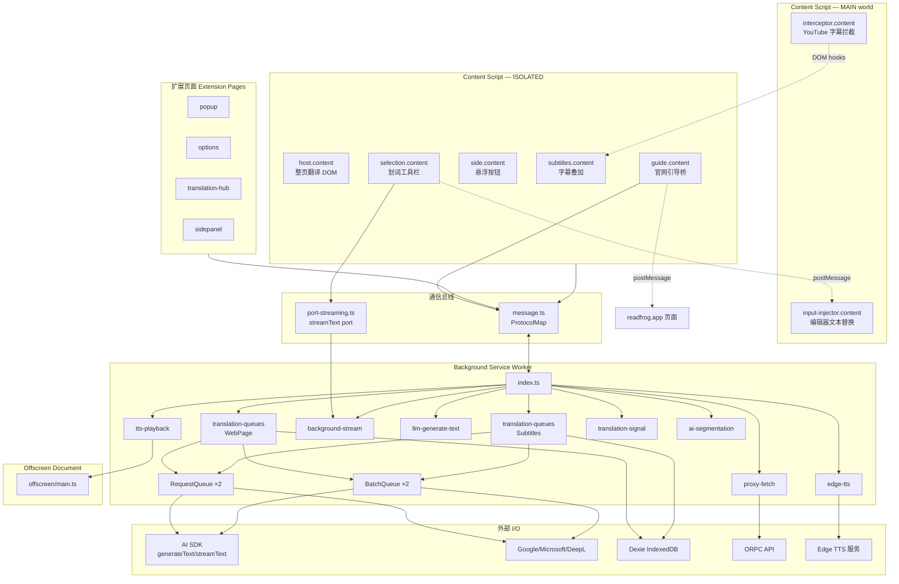

# 运行时拓扑结构

## 节点总图



---

## 入口点职责表

| 入口 | 路径 | 运行环境 | 核心职责 |
|------|------|----------|----------|
| background | `src/entrypoints/background/` | Service Worker | 消息枢纽、翻译队列、代理 fetch、流式 LLM、TTS、Dexie 写、ORPC |
| host.content | `src/entrypoints/host.content/` | ISOLATED, `*://*/*` | 整页翻译：DOM 遍历、注入译文、站点开关 |
| selection.content | `src/entrypoints/selection.content/` | ISOLATED | 划词工具栏（Shadow DOM UI）、流式/队列翻译 |
| side.content | `src/entrypoints/side.content/` | ISOLATED | 悬浮按钮、侧栏开关 |
| subtitles.content | `src/entrypoints/subtitles.content/` | ISOLATED, YouTube | 字幕获取、翻译叠加、设置面板 |
| interceptor.content | `src/entrypoints/interceptor.content/` | **MAIN**, `document_start` | 注入 YouTube Player API 钩子 |
| input-injector.content | `src/entrypoints/input-injector.content/` | **MAIN**, `document_start` | 接收 postMessage 替换编辑器文本 |
| guide.content | `src/entrypoints/guide.content/` | ISOLATED, 官网域名 | 官网 ↔ 扩展 pin 状态桥接 |
| popup | `src/entrypoints/popup/` | Extension Page | 快捷开关、翻译状态 |
| options | `src/entrypoints/options/` | Extension Page | 全量设置、队列调参、缓存清理 |
| translation-hub | `src/entrypoints/translation-hub/` | Extension Page | 多服务商翻译实验台（**直连 executeTranslate**） |
| sidepanel | `src/entrypoints/sidepanel/` | Extension Page | 侧边栏壳（Chromium） |
| offscreen | `src/entrypoints/offscreen/` | Offscreen Doc | HTMLAudioElement 播放 TTS |

---

## 通信机制

### 1. 类型化消息（主通道）

- **定义**：`src/utils/message.ts` → `ProtocolMap`
- **API**：`sendMessage` / `onMessage`（`@webext-core/messaging`）
- **注册**：`src/entrypoints/background/index.ts` 及子模块

消息分类：

| 类别 | 代表消息 | 方向 |
|------|----------|------|
| 翻译入队 | `enqueueTranslateRequest`, `enqueueSubtitlesTranslateRequest` | content/pages → background |
| 摘要预取 | `getOrGenerateWebPageSummary`, `getSubtitlesSummary` | content → background |
| 页面状态 | `setAndNotifyPageTranslationStateChangedByManager`, `askManagerToTogglePageTranslation` | ↔ background |
| 网络代理 | `backgroundFetch` | 任意 → background |
| LLM 辅助 | `backgroundGenerateText`, `aiSegmentSubtitles` | content → background |
| 流式（非消息） | port `streamText` | content → `background-stream.ts` |
| TTS | `edgeTtsSynthesize` → `ttsPlaybackStart` → `ttsOffscreenPlay` | UI → BG → offscreen |
| 缓存 | `clearAllTranslationRelatedCache` | options → background |

### 2. Port 流式通道

| 文件 | 职责 |
|------|------|
| `src/utils/content-script/port-streaming.ts` | 建立 port、收发 chunk/done/error |
| `src/utils/content-script/background-stream-client.ts` | `streamBackgroundText` 封装 |
| `src/entrypoints/background/background-stream.ts` | `onConnect` 分发 → AI SDK `streamText` |

### 3. window.postMessage（页面边界）

| 桥接 | 参与方 |
|------|--------|
| 输入框替换 | `selection.content` → `input-injector.content` |
| 官网引导 | `guide.content` ↔ `readfrog.app` 页面 |

### 4. WXT Storage（非消息）

| 存储 | 用途 | 管理方 |
|------|------|--------|
| local | 用户配置 `CONFIG_STORAGE_KEY` | `utils/config/storage` |
| session (tab) | 页面翻译开关、检测语言 | `translation-signal.ts` |
| session (ext) | HTTP 缓存组注册表 | `SessionCacheGroupRegistry` |

---

## 分层依赖

```
┌─────────────────────────────────────────┐
│  entrypoints/  (UI + 运行时入口)         │
├─────────────────────────────────────────┤
│  utils/        (业务逻辑 + 通信客户端)    │
├─────────────────────────────────────────┤
│  types/ + env/ (类型、配置 schema)       │
└─────────────────────────────────────────┘
         ↓ 仅向下依赖，禁止反向
```

| 层 | 允许依赖 | 禁止依赖 |
|----|----------|----------|
| `types/`, `env/` | 彼此、Zod | entrypoints, I/O, message |
| `utils/constants`, `utils/atoms` | types, env | 直接 provider fetch |
| `utils/request/` | types, retry | entrypoints, sendMessage |
| `utils/host/translate/` | types, prompts, **enqueue sendMessage** | content 侧直接 executeTranslate |
| `utils/content-script/` | message, port | AI SDK, Dexie |
| `utils/orpc/client.ts` | backgroundFetch | 原生跨域 fetch |
| `entrypoints/*.content` | utils 客户端 API | executeTranslate, Dexie 写, AI SDK |
| `entrypoints/background` | 全部 utils + I/O | DOM API |

---

## 单例与注册表

| 符号 | 位置 | 作用域 | 说明 |
|------|------|--------|------|
| `ProtocolMap` | `message.ts` | 全局 | 唯一消息契约 |
| `SessionCacheGroupRegistry` | `session-cache-group-registry.ts` | 扩展 session | HTTP 缓存组生命周期 |
| `RequestQueue` | `translation-queues.ts` | BG ×2 | 令牌桶限流 + hash 去重 |
| `BatchQueue` | `translation-queues.ts` | BG ×2 | LLM 请求合并 |
| `db` (Dexie) | `utils/db/dexie/db.ts` | BG 写 | 翻译/摘要/分段缓存 |
| Port handlers | `background-stream.ts` | BG | `streamText` 等 |

**注意**：网页队列与字幕队列各有一套 RQ/BQ，不可合并。